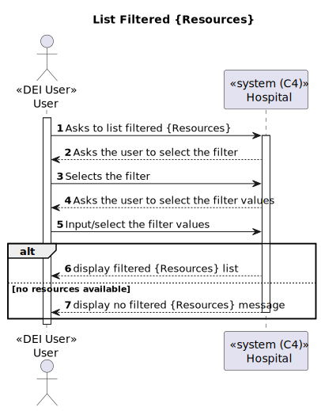
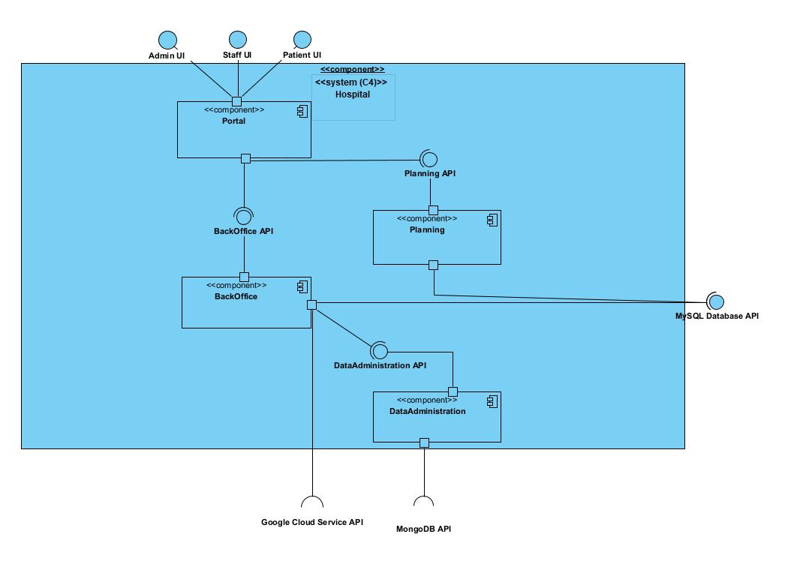

## **Project Introduction**

### **1. Project Scope**

This project aims to create a prototype system for surgical requests, appointments, and resource management. The system will enable hospitals and clinics to manage surgery appointments and patient records.  
The modules in question takes into consideration the legal aspects of the GDPR Regulation (EU) 2016/679, which is a regulation in EU law on data protection and privacy for all individuals within the European Union and the European Economic Area. It also addresses the transfer of personal data outside the EU and EEA areas. The GDPR aims primarily to give control to individuals over their personal data and to simplify the regulatory environment for international business by unifying the regulation within the EU.

### **2. Project Overview**

The system will consist of several modules:
- Backoffice
- Portal
- Planning

Overall, this modules were devolped in order to manage:
- Medical Professionals (doctors, nurses)
- Patients
- Operation Types
- Operation Requests

### **3. Views**

#### **Introduction**

We will adopt the combination of two architectural representation models: C4 and 4+1.

#### **4+1 View Model**

The 4+1 view model proposes the description of the system through complementary views, each one with a specific purpose. This method allows the perception of the system from different perspectives, which facilitates the understanding of the system as a whole.

The views are:
- **Logical View**: Its goal is to answer to business challenges/requirements regarding software aspects.
- **Process View**: Demonstrates the system's flow and interactions.
- **Development View**: Regards the software organization in its development environment.
- **Physical View**: Maps the various software elements to the hardware components, e.g., where the software is executed.
- **Scenery View**: Represents the association between the business processes and the actors that will trigger them.

#### **C4 Model**

The C4 model describes software using four levels of abstraction: system context, containers, components, and code. Each adopts a thinner layer of granularity, allowing more detailed description of the system in smaller parts. We can think of it as zooming in on the system.

The levels are:
- **System Context**: The highest level of abstraction, aimed at demonstrating the system's scope.
- **Containers**: Describe system containers.
- **Components**: Describe the components within the containers.
- **Code**: Describes the components' code or provides more detailed information.

#### **Overview**

By combining the two models, it is possible to represent the system from various perspectives, each with different levels of detail. To represent/model the implemented and proposed solutions, we will use Unified Modeling Language (UML) as the notation.

### **Level 1**

## **Process Views**

# **Create**

# **Edit**

# **Delete**

# **List Unfiltered**

# **List Filtered**

## **Scenery View**

## **Logical View**

### **Level 2**

## **Process Views**

# **Create**

# **Edit**

# **Delete**

# **List Unfiltered**

# **List Filtered**

## **Logical View**

## **Deployment View**

## **Physical View**

### **Level 3**

## **Process Views**

# **Create**

# **Edit**

# **Delete**

# **List**

## **Logical View**

## **Deployment View**

### **4. Domain Model**

